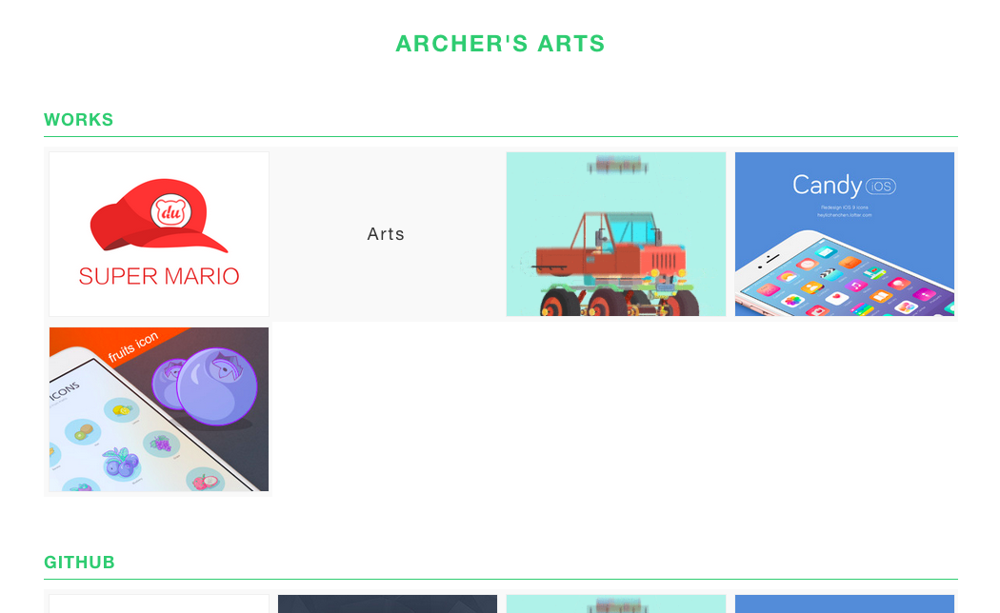

### About

a-Arts is a JS-TOOL to help you to make a beautiful arts-show-page.



Inspired from [yart](https://github.com/JoyNeop/yart)

### How To Use

**step1: git clone**


```shell
git clone https://github.com/qddegtya/a-Arts.git
```


**step2: make your own content**

Just edit index.html for fun!!!

```
__ ARCHER'S ARTS

  ## WORKS

  --(http://www.baidu.com "CED")[http://img.ui.cn/data/file/6/1/0/368016.png]
  --(http://www.baidu.com "Arts")[http://img.ui.cn/data/file/7/9/7/365797.jpg]
  --(http://www.baidu.com "Koa")[http://img.ui.cn/data/file/9/8/3/365389.gif]
  --(http://www.baidu.com "Express")[http://img.ui.cn/data/file/4/1/2/367214.jpg]
  --(http://www.baidu.com "JSON")[http://img.ui.cn/data/file/7/0/0/363007.jpg]

```

### Syntax

```
1. __: page title
2. --: art item
3. (http://test.com "a"): art's url & art's name
4. [http://test.com/test.png]: art's thumb
```

### Online demo

[http://xiaoa.name/arts](http://xiaoa.name/arts/)


### License
MIT
